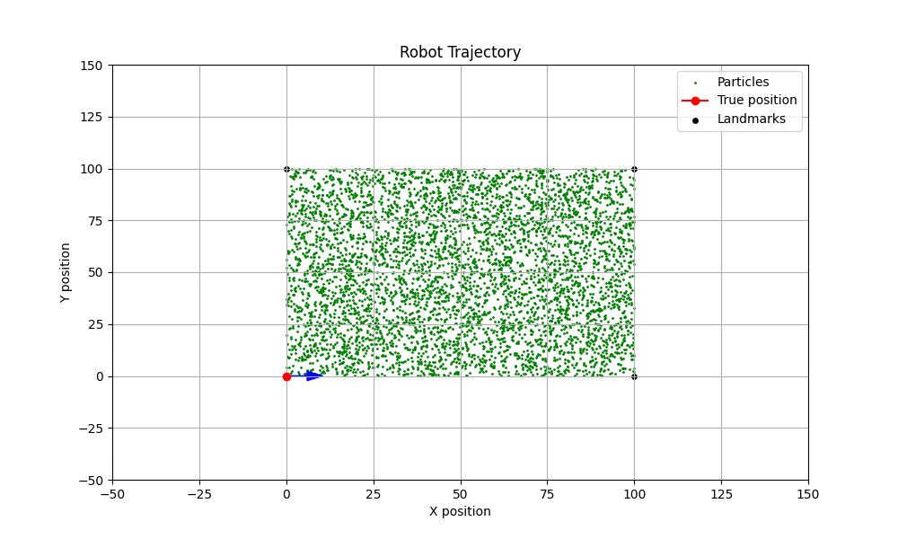

# Particle Filter for Estimating Robot Position with Bicycle Model

This repository contains a Python implementation of a Particle Filter used to estimate the position of robot with bicycle model.

### Overview

In this project, the robot follows a predefined trajectory, and the goal is to estimate its position using the Particle Filter algorithm. The robot's motion is modeled using a bicycle model, which simulates realistic robot behavior by adding steering and forward noises.

### Demonstration

Here's a visual demonstration of the Particle Filter in action:



### Usage

To run the code, clone this repository and execute the main script:

```bash
git clone https://github.com/yourusername/particle-filter-bicycle-model.git
cd particle-filter-bicycle-model
python main.py
